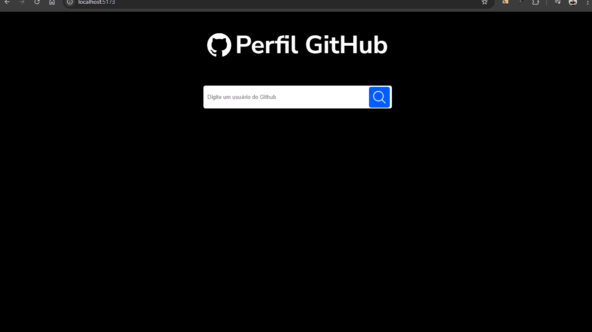

## 📌 Sobre o Projeto
Foi desenvolvido como parte de um desafio técnico, com o objetivo de criar uma interface moderna e interativa para exibição de conteúdo educacional. Utilizando tecnologias modernas do ecossistema front-end, o projeto entrega uma experiência dinâmica e responsiva para os usuários.

## 🚀 Tecnologias Utilizadas

O projeto foi desenvolvido com as seguintes tecnologias:

- **HTML5** - Estrutura da página
- **CSS3** - Estilização com Styled-Components
- **JavaScript (ES6+)** - Funcionalidades dinâmicas
- **React.js** - Biblioteca para construção da interface
- **Styled-Components** - Estilização com componentes dinâmicos


## 📷 Capturas de Tela

</img>

## 🔧 Como Executar o Projeto

Para rodar o projeto localmente, siga os passos abaixo:

1. **Clone o repositório:**
   ```bash
   https://github.com/hpbeta/desafio-tecnico-2
   ```

2. **Acesse a pasta do projeto:**
   ```bash
   cd desafio-tecnico-2
   ```

3. **Instale as dependências:**
   ```bash
   npm install
   # ou
   yarn install
   ```

4. **Inicie o servidor de desenvolvimento:**
   ```bash
   npm start
   # ou
   yarn start
   ```

O projeto será iniciado em `http://localhost:3000/`.

## 🎨 Estilização
A estilização do projeto foi feita utilizando **Styled-Components**, o que permite um alto nível de personalização e componentização, tornando o código mais organizado e reutilizável.


## 📌 Funcionalidades
- Interface responsiva
- Navegação fluida entre componentes

---
Desenvolvido por **João Lucas** 🚀
